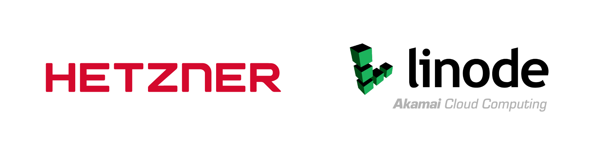
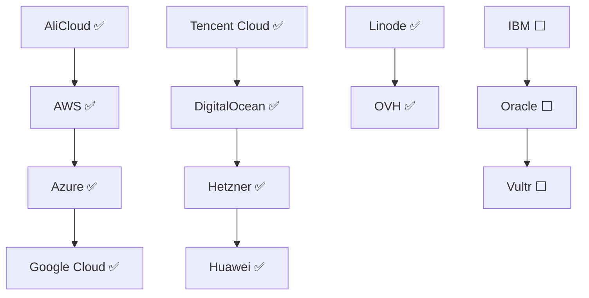
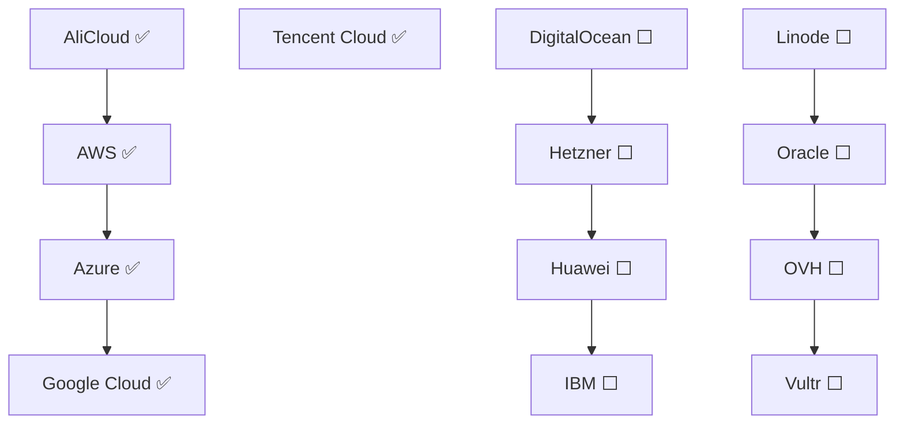
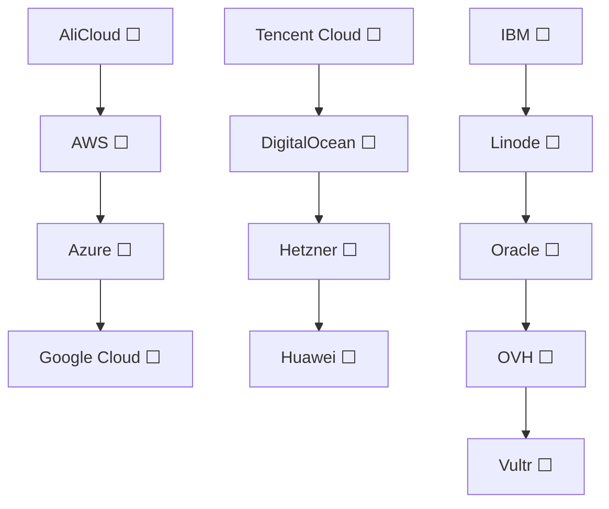

<h1 align="center">HOMELAB INFRASTRUCTURE TERRAGRUNT</h1>

  

<h2 align="center">SUPPORTED CLOUD PROVIDERS</h2>

    

  

---

  

    

  

---

Homelab infrastructure repository for Terragrunt environment management. Currently supporting the following 13 cloud providers to run a TalosOS Kubernetes cluster:

Cloud providers supporting a custom terraform state backend:
- AliCloud (`oss` backend)
- AWS (`s3` backend)
- Azure (`azurerm` backend)
- Google Cloud (`gcs` backend)
- Tencent Cloud (`cos` backend)

Cloud providers not supporting a custom terraform state backend (Must be used with above mentioned providers for state management):
- DigitalOcean Cloud
- Hetzner Cloud
- Huawei Cloud
- IBM Cloud
- Linode (Akamai) Cloud
- Oracle Infrastructure Cloud
- OVH Cloud
- Vultr Cloud

Finally there is support for the bare-metal setup, however this requires a correct server setup and configuration.

Pull requests for features/modifications/suggestions are welcome for a better integration/abstraction mechanisms of IaC, since this repository is still in development and managed in my free time as a Bachelor's thesis project.

## Roadmap progress of the project

**Provider setup:**

**Terraform state backend setup:**

**Cloud specific infrastructure setup:**

**TalosOS Kubernetes cluster setup:**

**Adapt the development environment to staging environment:**

**Addapt the staging environment to production environment:**

## Requirements

Infrastructure as a code (IaC) tools that are required to manage the infrastructure:

- [Terraform](https://www.terraform.io/downloads.html)
- [Terragrunt](https://terragrunt.gruntwork.io/docs/getting-started/install/)

Optionally you caninstall the cloud provider CLI tools for debuging the infrastructure:

- Main providers supporting its own terraform state backends:
    - [AliCloud CLI](https://github.com/aliyun/aliyun-cli)
    - [AWS CLI](https://github.com/aws/aws-cli)
    - [Azure CLI](https://github.com/Azure/azure-cli)
    - [Google Cloud SDK](https://cloud.google.com/sdk/docs/install-sdk)
    - [Tencent Cloud CLI](https://github.com/TencentCloud/tencentcloud-cli)

- Other providers using the above mentioned terraform state backends:
    - [DigitalOcean CLI](https://github.com/digitalocean/doctl)
    - [Hetzner Cloud CLI](https://github.com/hetznercloud/cli)
    - [Huawei Cloud CLI - KooCLI](https://support.huaweicloud.com/intl/en-us/qs-hcli/hcli_02_003.html)
    - [IBM Cloud CLI](https://github.com/IBM-Cloud/ibm-cloud-cli-release)
    - [Linode CLI](https://github.com/linode/linode-cli)
    - [Oracle Infrastructure Cloud CLI](https://github.com/oracle/oci-cli)
    - [OVH CLI](https://github.com/ovh/ovh-cli)
    - [Vultr CLI](https://github.com/vultr/vultr-cli)
